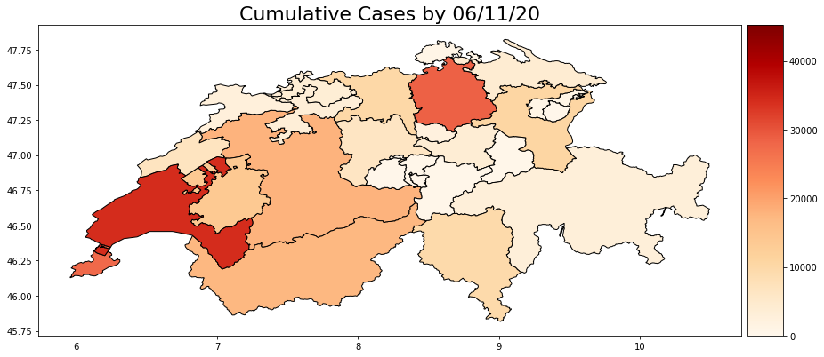
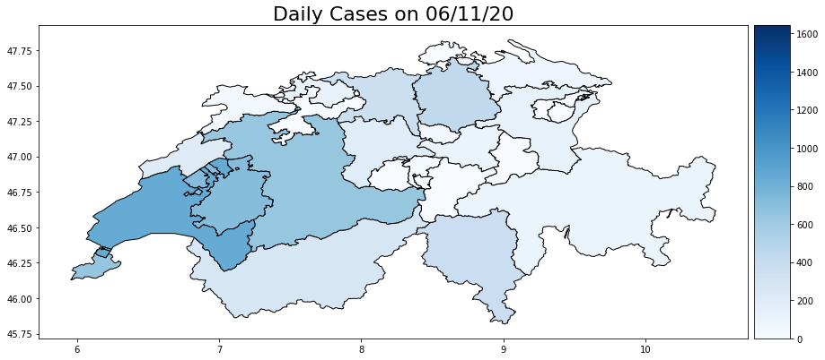

# Covid19 Geospatial Analysis
 
## Overview
Visualising Covid-19 case data with a map of Switzerland. 
  

## Data Source
Case information provided online by ETH University Zurich.
  

## Example Maps
 

    

  